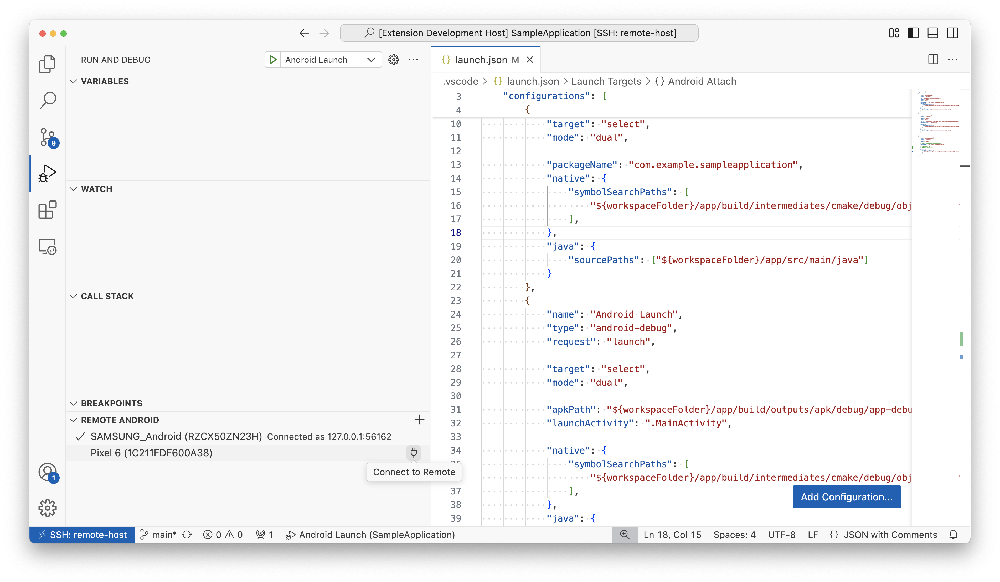

# vscode-remote-adb · Remote Android Development in VS Code

Use local Android devices or emulators for debugging when using [VS Code Remote Development](https://code.visualstudio.com/docs/remote/remote-overview).

## Features
- Connect and share locally connected Android devices directly from VS Code.
- Share wireless or USB connected device including locally running Android Emulators.
- Connected devices are available for debugging using any tools on the remote machine via `adb`.

## Quick Start
- Find the "Remote Android" view in Debug panel, when connected to remote host.
- Choose a device and "Connect to Remote".
